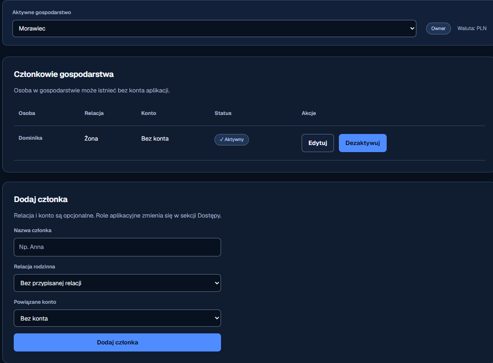
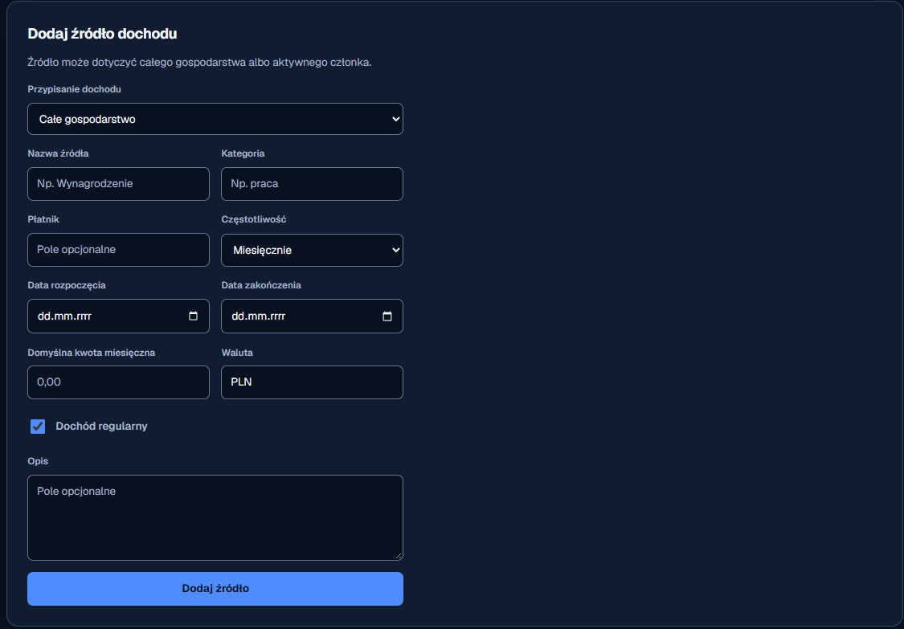

# Przegląd wykorzystania przestrzeni

## Ocena ogólna

Kolory, typografia, obramowania i tabela tworzą spójny ekran, ale układ formularzy nie wykorzystuje dostępnej szerokości. Bezwarunkowa reguła `.panel > form { max-width: 520px; }` łączy wszystkie formularze z jednym rozmiarem, mimo że formularz członka jest prosty, a formularz dochodu złożony. Karta pozostaje pełnej szerokości, więc ograniczenie formularza tworzy duży pusty obszar bez funkcji.

## Kroki i ustalenia

### 1. Członkowie gospodarstwa — stan wymaga poprawy

- Tabela dobrze wykorzystuje szerokość i ma czytelne kolumny.
- Formularz pod tabelą zajmuje mniej niż połowę karty, a pozostała część powierzchni nie wspiera żadnego zadania.
- Formularz członka i panel relacji są powiązanymi zadaniami konfiguracyjnymi, dlatego na szerokim ekranie powinny tworzyć dwie sąsiednie kolumny.
- Pełna szerokość przycisku „Dodaj członka” nadaje mu zbyt duży ciężar wizualny względem trzech pól.

### 2. Aktywne gospodarstwo — stan wymaga poprawy

- Etykieta jest czytelna, a kontrolka ma właściwą wysokość.
- Selektor rozciąga się do całej dostępnej szerokości mimo krótkiej wartości. Na desktopie osłabia to grupowanie selektora z metadanymi roli i waluty.
- Kontrolka powinna mieć przewidywalną maksymalną szerokość, a na wąskim ekranie nadal zajmować cały dostępny wiersz.

### 3. Formularz źródła dochodu — stan słaby

- Kolejność pól jest logiczna, etykiety są widoczne, a grupowanie par pól jest spójne.
- Złożony formularz ma tę samą granicę `520px` co proste formularze. Osiem pól, checkbox, opis i akcja tworzą długą lewą kolumnę, podczas gdy ponad połowa karty pozostaje pusta.
- Na szerokim ekranie pola powinny układać się w trzy kolumny, z większymi polami zajmującymi odpowiedni span. Układ powinien przechodzić do dwóch i jednej kolumny zależnie od miejsca.
- Przycisk powinien mieć szerokość treści na desktopie; pełna szerokość jest uzasadniona dopiero na telefonie.

## Najważniejsze zmiany

1. Zastąpić globalny limit bezpośredniego formularza jawnymi wariantami układu: kompaktowym i szerokim.
2. Ułożyć formularz członka i relacje obok siebie na szerokim ekranie, zachowując pełną szerokość tabeli członków.
3. Rozszerzyć formularz dochodu do responsywnej siatki trzech, dwóch i jednej kolumny.
4. Ograniczyć szerokość selektora gospodarstwa i zachować wspólny wiersz z rolą oraz walutą.
5. Zmniejszyć szerokość głównych akcji na desktopie i zachować pełną szerokość na telefonie.

## Dostępność i ograniczenia dowodów

Na zrzutach widać etykiety, odpowiednie rozmiary kontrolek i tekstowe statusy. Ze statycznych obrazów nie można potwierdzić kolejności tabulacji, widoczności `focus-visible`, kontrastu w każdym stanie ani zachowania przy powiększeniu. Te elementy wymagają sprawdzenia w przeglądarce po implementacji.

## Uwaga po przeglądzie: miejsce sekcji „Dostępy”

Użytkownik zakwestionował obecność „Dostępów” w głównej nawigacji obok członków i dochodów. Uwaga jest zasadna: role i zaproszenia są czynnościami administracyjnymi, więc powinny być mniej eksponowane niż codzienne dane. Rekomendowane miejsce to **Gospodarstwo → Ustawienia gospodarstwa → Dostępy**. Nie są to ustawienia osobistego konta: uprawnienia dotyczą aktywnego gospodarstwa, a jedna osoba może należeć do wielu gospodarstw z różnymi rolami. Osobne **Moje konto** powinno obejmować dane logowania i preferencje użytkownika. Użytkownik zaakceptował rekomendację; po rozszerzeniu zakresu bolta 009 przeniesiono „Dostępy” do ustawień gospodarstwa.
