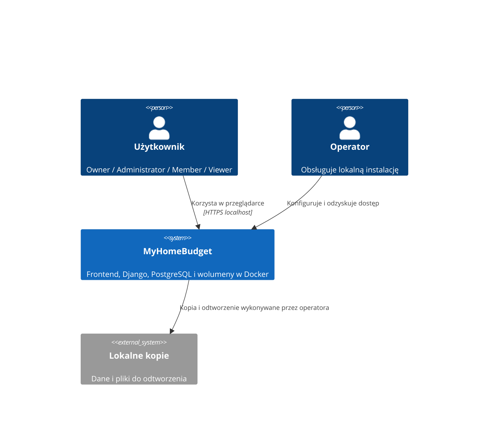

# Kontekst systemu — MVP 1

## Aktorzy
Operator lokalnej instalacji uruchamia Docker, konfiguruje pierwsze konto, odzyskuje dostęp i wykonuje kopie.
Owner zarządza gospodarstwem, zaproszeniami i rolami. Administrator edytuje członków i dochody.
Member i Viewer odczytują członków i źródła. Osoba zaproszona zakłada konto albo korzysta z istniejącego.
Członek gospodarstwa bez konta jest obiektem danych, nie aktorem logowania.

## Granice
Aplikacja obejmuje frontend React/TypeScript, modularny monolit Django, PostgreSQL i trwałe pliki w kontenerach na komputerze użytkownika.
Przeglądarka działa na tym samym komputerze. Link zaproszenia localhost nie udostępnia aplikacji na innym urządzeniu.
Runtime Docker i system plików hosta są zależnościami eksploatacyjnymi. PostgreSQL jest elementem systemu, nie usługą zewnętrzną.

## Przepływy
| Kierunek | Dane | Kontrola |
|---|---|---|
| Przeglądarka → aplikacja | Konto, dane gospodarstwa, członkowie, dochody, token zaproszenia | Walidacja, sesja, uprawnienia gospodarstwa |
| Aplikacja → przeglądarka | Wynik operacji i dane bieżącego gospodarstwa | Brak danych obcych gospodarstw i sekretów |
| Django ↔ PostgreSQL | Dane domenowe, sesje zgodnie z projektem, audyt | Transakcje i migracje |
| Operator ↔ lokalne kopie | Baza, pliki i konfiguracja do odtworzenia | Kopia poza cyklem życia kontenerów |

## Zależności zewnętrzne
Brak banków, SMTP, dostawcy logowania i usług kursowych w działaniu MVP 1.
Pobranie obrazów i pakietów podczas budowania może wymagać internetu; uruchomienie lokalne nie oznacza gwarancji instalacji offline.
Arkusze Excel są materiałem źródłowym przyszłych etapów, bez importu w MVP 1.

## Diagram

## Ograniczenia
Obowiązują zatwierdzone requirements.md i standardy projektu. Lokalny HTTPS, dokładne wersje, biblioteka API i kontrakty zostaną opracowane w pierwszych etapach Construction.
Brak publicznej rejestracji; pierwsze konto jednorazowo, pozostałe przez zaproszenia. Dane finansowe nie są float.
