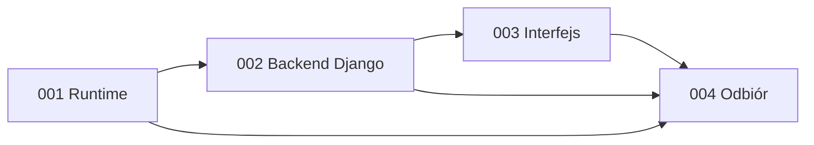

# Podział MVP 1 na jednostki

Status: plan do przeglądu. Wymagania zatwierdzone przez użytkownika.

| Jednostka | Odpowiedzialność | Zależności | Stories |
|---|---|---|---|
| 001-local-runtime | Lokalne środowisko Docker | Brak | 2 |
| 002-foundation-api | Domeny fundamentu w Django | 001-local-runtime | 13 |
| 003-household-foundation-ui | Interfejs gospodarstwa | 001-local-runtime, 002-foundation-api | 6 |
| 004-local-acceptance | Odbiór i eksploatacja lokalna | 001-local-runtime, 002-foundation-api, 003-household-foundation-ui | 3 |

Backend jest pojedynczą jednostką wdrożenia z rozdzielonymi modułami auth, households, members, income i audit. Nie tworzymy mikroserwisów.
Jednostki runtime i odbioru są pracą infrastrukturalną. Nie są niezależnymi usługami biznesowymi.
Frontend jest osobną jednostką realizacji interfejsu, zależną od backendu.

## Odpowiedzialność za wymagania
Każdy FR ma dokładnie jednego właściciela: 002-foundation-api. Jednostka UI realizuje jego warstwę wizualną, nie przejmuje reguł domenowych.
- FR-01 → 002-foundation-api
- FR-02 → 002-foundation-api
- FR-03 → 002-foundation-api
- FR-04 → 002-foundation-api
- FR-05 → 002-foundation-api
- FR-06 → 002-foundation-api
- FR-07 → 002-foundation-api
- FR-08 → 002-foundation-api
- FR-09 → 002-foundation-api
NFR-01 i NFR-03: egzekwowanie w backendzie, potwierdzenie przez odbiór.
NFR-02: runtime, następnie test trwałości i odtworzenia w odbiorze.

## Kolejność

## Bolty
- [001-local-runtime](../../bolts/001-local-runtime/bolt.md): Docker, konfiguracja i trwałość; 2 stories.
- [002-foundation-api](../../bolts/002-foundation-api/bolt.md): Konta, sesje i odzyskanie dostępu; 3 stories.
- [003-foundation-api](../../bolts/003-foundation-api/bolt.md): Gospodarstwa, role i izolacja; 3 stories.
- [004-foundation-api](../../bolts/004-foundation-api/bolt.md): Zaproszenia bez e-maili; 2 stories.
- [005-foundation-api](../../bolts/005-foundation-api/bolt.md): Członkowie, dochody i audyt; 5 stories.
- [006-household-foundation-ui](../../bolts/006-household-foundation-ui/bolt.md): Interfejs kont, gospodarstw i zaproszeń; 3 stories.
- [007-household-foundation-ui](../../bolts/007-household-foundation-ui/bolt.md): Interfejs członków i dochodów; 2 stories.
- [009-household-foundation-ui](../../bolts/009-household-foundation-ui/bolt.md): Gęstość i responsywność ekranów gospodarstwa; 1 story.
- [008-local-acceptance](../../bolts/008-local-acceptance/bolt.md): Odbiór, kopie i wydajność; 3 stories.
Kolejność jest celowo sekwencyjna dla lokalnego projektu; moduły backendu nadal mają oddzielne testy i odpowiedzialności.
