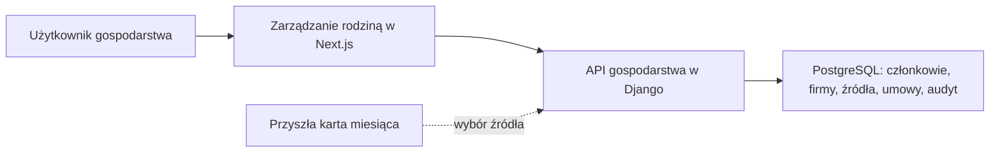

# Kontekst: zarządzanie rodziną i źródłami dochodu

## Granica systemu

Rozszerzenie działa w obecnej lokalnej aplikacji: przeglądarka → Next.js → API Django → PostgreSQL. Korzysta z istniejących kont, ról, gospodarstw, członków i audytu. Nie wymaga usług zewnętrznych ani automatycznego pobierania danych o firmach.

## Aktorzy

| Aktor | Działanie |
| --- | --- |
| Owner lub Administrator | Dodaje i zmienia firmy, umowy i inne źródła dochodu w swoim gospodarstwie. |
| Member lub Viewer | Odczytuje dane bez możliwości ich zmiany. |
| Przyszła karta miesiąca | Wybiera członka lub gospodarstwo i jedno z jego źródeł; zapis miesięczny powstanie w osobnym intentcie. |

## Diagram kontekstu

## Dane i przepływy

- Wejście: nazwa firmy, rodzaj i warunki umowy, osoba, daty, kwota brutto z podstawą, waluta oraz dane innego źródła dochodu.
- Wyjście: listy i szczegóły ograniczone do wybranego gospodarstwa, z rozróżnieniem umowy i innego źródła.
- Każdy zapis sprawdza rolę, aktywność i przynależność powiązanych obiektów oraz pozostawia wymagany ślad audytowy.
- Dane historyczne `IncomeSource` pozostają dostępne po migracji jako inne źródła, bez tworzenia umów i przychodów miesięcznych.

## Granice i zależności

- Warunkiem rozpoczęcia zmian kodu jest zamknięcie bolta 008, który odbiera istniejący fundament po bolcie 009.
- Nie ma integracji z rejestrem firm, bankami ani systemem płac.
- Użytkownik nie wprowadza w tym etapie przychodu przypisanego do miesiąca.
