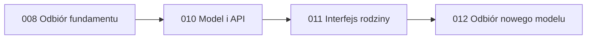

# Jednostki pracy

| Jednostka | Odpowiedzialność | Zależności |
| --- | --- | --- |
| 001-family-income-api | Reguły firm, umów i źródeł; migracja, API, dostęp i audyt. | Istniejący fundament API; bolt 008 przed budową. |
| 002-family-management-ui | Dział „Zarządzanie rodziną”, formularze i prezentacja źródeł. | 001-family-income-api. |
| 003-family-income-acceptance | Odbiór migracji i przepływu użytkownika na lokalnej instalacji. | 001-family-income-api, 002-family-management-ui. |

Backend pozostaje częścią obecnego monolitu Django. Jednostki oznaczają granice pracy, a nie nowe procesy lub usługi. Frontend korzysta z API i nie przejmuje walidacji uprawnień ani kwot.

## Właściciel wymagań

Każde wymaganie ma jednego właściciela reguły. UI i odbiór realizują lub sprawdzają jego widoczne zachowanie.

| Wymaganie | Właściciel | Udział pozostałych jednostek |
| --- | --- | --- |
| FR-01 Nawigacja i członkowie | 002-family-management-ui | API dostarcza istniejących członków i nowe źródła. |
| FR-02 Słownik firm | 001-family-income-api | UI udostępnia wybór i tworzenie. |
| FR-03 Umowa | 001-family-income-api | UI udostępnia formularz i listę. |
| FR-04 Inne źródło | 001-family-income-api | UI udostępnia formularz i listę. |
| FR-05 Granica miesięcznego przychodu | 001-family-income-api | UI wyjaśnia znaczenie kwot; odbiór sprawdza brak miesięcznych zapisów. |
| FR-06 Migracja i historia | 001-family-income-api | UI pozwala jawnie uzupełnić dane umowy; odbiór sprawdza migrację. |
| FR-07 Dostęp i izolacja | 001-family-income-api | UI ukrywa edycję bez uprawnień; odbiór sprawdza API. |

## Przewidywane zmiany w kodzie

| Obszar | Pliki lub moduły | Plan |
| --- | --- | --- |
| Model danych | `backend/households/models.py`, nowa migracja | Firma, szczegóły umowy powiązane ze źródłem, rodzaj źródła, opcjonalna kwota domyślna. |
| Reguły i API | `backend/households/record_services.py`, `record_serializers.py`, `record_views.py`, `urls.py` | Osobne operacje firm i umów, istniejące źródła jako „inne”, wspólna walidacja gospodarstwa i audyt. |
| Testy API | `backend/households/tests/test_records.py` i nowe testy domenowe | Role, izolacja, kwoty, daty, migracja, jawna konwersja istniejącego źródła. |
| Interfejs | `frontend/app/components/household-shell.tsx`, `members-panel.tsx`, `income-panel.tsx`, `frontend/app/lib/api.ts` | Nawigacja rodziny, sekcje osób i gospodarstwa, osobne formularze umowy i źródła. |
| Wygląd i odbiór | `frontend/app/globals.css`, `frontend/tests/records.spec.ts`, lokalne testy E2E | Responsywne listy, formularze i rzeczywisty scenariusz po migracji. |

Przed dodaniem funkcji lub komponentu etap Construction ponownie wyszuka istniejące odpowiedniki. Szczegółowa lista plików może się zmienić po modelowaniu DDD w bolcie 010.

## Kolejność

## Bolty

- [010-family-income-api](../../bolts/010-family-income-api/bolt.md): model, migracja i API.
- [011-family-management-ui](../../bolts/011-family-management-ui/bolt.md): nowa organizacja ekranów i formularzy.
- [012-family-income-acceptance](../../bolts/012-family-income-acceptance/bolt.md): odbiór migracji, uprawnień i scenariusza użytkownika.
