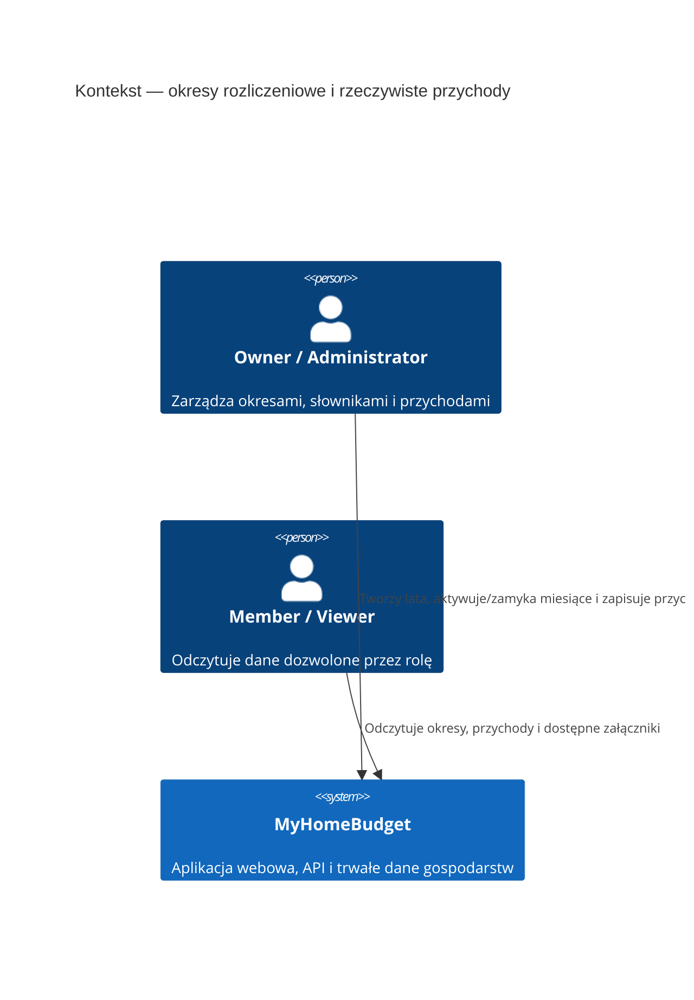

# Okresy rozliczeniowe i rzeczywiste przychody — kontekst systemu

## Przegląd systemu

Funkcja rozszerza istniejący MyHomeBudget o lata rozliczeniowe z dwunastoma miesiącami oraz ręcznie rejestrowane przychody rzeczywiste przypisane do członka rodziny albo gospodarstwa. Użytkownik pracuje w istniejącej aplikacji webowej. Backend egzekwuje role i izolację danych; istniejący słownik źródeł dochodu i umów dostarcza wyborów do wpisu. Załączniki przechodzą przez autoryzowany przepływ aplikacji.

## Aktorzy

- **Owner** (użytkownik): tworzy lata, aktywuje i zamyka miesiące oraz zarządza wpisami i źródłami w granicach obecnej roli.
- **Administrator** (użytkownik): zarządza wpisami okresów i przychodów w granicach obecnej roli.
- **Member** (użytkownik): odczytuje dozwolone okresy i wpisy gospodarstwa; bez praw zapisu.
- **Viewer** (użytkownik): odczytuje dozwolone okresy i wpisy gospodarstwa; bez praw zapisu.

## Zewnętrzne systemy i zależności

- **Brak zewnętrznych integracji w v1.** Funkcja korzysta z istniejącego MyHomeBudget, bazy danych gospodarstwa oraz skonfigurowanego przez aplikację prywatnego magazynu załączników. Nie wysyła danych do banku, dostawcy OCR ani zewnętrznego systemu plików.
- **Istniejące domeny aplikacji**: konta i role gospodarstwa, członkowie rodziny, `IncomeSource` oraz `Contract`.

## Granice i przepływy danych

### Wejście

- Użytkownik wybiera gospodarstwo, rok, miesiąc, odbiorcę i słownikowe źródło przychodu.
- Formularz przesyła kwotę, walutę, faktyczną datę uzyskania przychodu oraz zero lub więcej plików PNG, JPG/JPEG albo PDF.
- Użytkownik z rolą zapisu może dodać nowe `IncomeSource` do słownika z poziomu formularza; system waliduje wpis jak każde inne źródło.
- Backend sprawdza aktualną rolę, aktywność miesiąca, powiązanie odbiorcy i źródła z gospodarstwem oraz status zamknięcia przed zapisem.

### Wyjście

- Aplikacja prezentuje statusy lat/miesięcy, listę wpisów oraz podsumowania okresu pogrupowane według waluty.
- Autoryzowany użytkownik może pobrać załącznik powiązany z wpisem; dane źródła są prezentowane z odwołaniem do słownika.
- Każdy zapis oraz zmiana statusu okresu tworzą zdarzenia audytowe zgodnie ze standardem aplikacji.

## Diagram kontekstu

## Ograniczenia wysokiego poziomu

- Cały zapis jest ograniczony do aktywnego gospodarstwa; backend pozostaje źródłem prawdy dla uprawnień.
- Rok zawsze zawiera dwanaście miesięcy. Każdy miesiąc jest aktywowany jawnie; wiele miesięcy może być aktywnych jednocześnie i w dowolnej kolejności.
- Data uzyskania przychodu może przypadać poza miesiącem rozliczeniowym, do którego wpis zostanie przypisany.
- Każdy przychód wskazuje źródło ze słownika `IncomeSource`; nie dopuszcza się swobodnego tekstu zamiast źródła.
- Kwota umowy nie jest automatycznie traktowana jako uzyskany przychód.
- Załączniki obsługują wiele plików na wpis w formatach PNG, JPG/JPEG i PDF; limity oraz zachowanie historycznych danych źródła wymagają decyzji projektowej.

## Główne cele jakościowe

- Bezpieczeństwo: izolacja gospodarstw, istniejący model ról, prywatny dostęp do załączników.
- Integralność: atomowe zapisy wpisu z audytem; zamknięty miesiąc blokuje zapisy do czasu jawnego ponownego otwarcia.
- Historia: wartości przychodu pozostają odrębne od konfiguracji umowy; sposób zachowania historycznego obrazu źródła zostanie określony w Construction.
