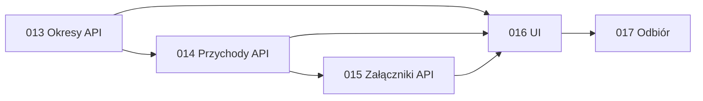

# Jednostki pracy

Backend pozostaje częścią modularnego monolitu Django. Jednostki są granicami planowania i weryfikacji; nie oznaczają nowych usług. Reguły, uprawnienia i walidacja pozostają po stronie API.

## Właściciel wymagań

Każdy FR ma dokładnie jednego właściciela reguły. UI dostarcza zachowania widoczne dla użytkownika, a jednostka akceptacyjna sprawdza integrację bez przejmowania własności FR.

| Wymaganie | Właściciel | Udział pozostałych jednostek |
| --- | --- | --- |
| FR-01 Lata rozliczeniowe | 001-periods-api | UI nawigacji i listy; acceptance weryfikuje komplet 12 miesięcy. |
| FR-02 Jawne uruchamianie miesięcy | 001-periods-api | UI pokazuje stan i akcję; acceptance sprawdza niezależną kolejność aktywacji. |
| FR-03 Rzeczywiste wpisy przychodów | 002-monthly-income-api | UI formularza; acceptance sprawdza odbiorcę i wiele wpisów. |
| FR-04 Słownik źródeł przychodu | 002-monthly-income-api | UI wyboru i szybkiego dodania; używa istniejących `IncomeSource` i `Contract`. |
| FR-05 Kwota, waluta i data | 002-monthly-income-api | UI formularza; acceptance sprawdza datę poza miesiącem i grupowanie walut. |
| FR-06 Załączniki | 002-monthly-income-api | UI wyboru i pobierania; acceptance sprawdza prywatny dostęp. |
| FR-07 Zamknięcie i ponowne otwarcie | 001-periods-api | API przychodów egzekwuje blokadę; UI pokazuje stan i akcję. |
| FR-08 Podsumowania | 002-monthly-income-api | UI prezentuje sumy; acceptance porównuje je z wpisami. |

## Jednostki

| Jednostka | Odpowiedzialność | Typ i bolty | Zależności |
| --- | --- | --- | --- |
| 001-periods-api | Tworzenie roku i 12 nieaktywnych miesięcy, niezależna aktywacja, zamykanie/otwieranie, role i audyt. | Backend, DDD; 013. | Fundament gospodarstw i ról. |
| 002-monthly-income-api | Faktyczne wpisy, powiązanie odbiorcy i słownikowego źródła, kwoty/waluty/daty, sumy oraz prywatne załączniki. | Backend, DDD; 014–015. | 001-periods-api, istniejący 001-family-income-api. |
| 003-periods-income-ui | Nawigacja i formularze okresów/przychodów oraz prezentacja podsumowań i załączników. | Frontend, simple; 016. | Obie jednostki API oraz istniejący 002-family-management-ui. |
| 004-periods-income-acceptance | Zintegrowany scenariusz lat, stanów, uprawnień, przychodów, źródeł i załączników. | Acceptance, simple; 017. | Jednostki 001–003. |

## Przewidywana kolejność

## Granice projektowe

- 014 rejestruje wpisy bez wyliczania kwoty z brutto umowy ani domyślnej kwoty źródła.
- 014 korzysta ze stabilnego identyfikatora `IncomeSource`; szczegóły zachowania historycznego obrazu źródła/odbiorcy rozstrzyga Construction przed implementacją.
- 015 ustala limity liczby i rozmiaru plików w projekcie technicznym; przyjmuje wiele PNG, JPG/JPEG i PDF oraz wymaga autoryzowanego pobrania.
- 016 podlega bramce projektowania z `memory-bank/standards/ui-design-review.md`: plan, wizualizacja, niezależna ocena ze Score > 7,5/10 i jawna akceptacja przed kodem.
- 017 używa danych syntetycznych i weryfikuje izolację gospodarstw; nie używa danych finansowych użytkownika.
